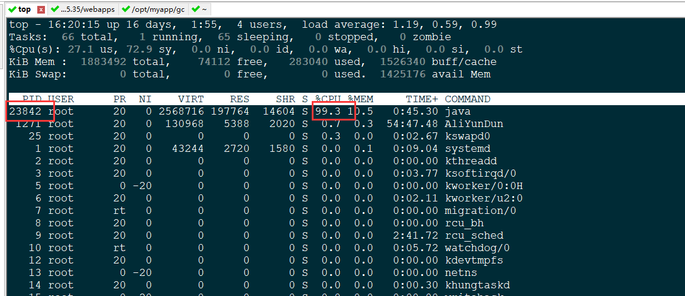
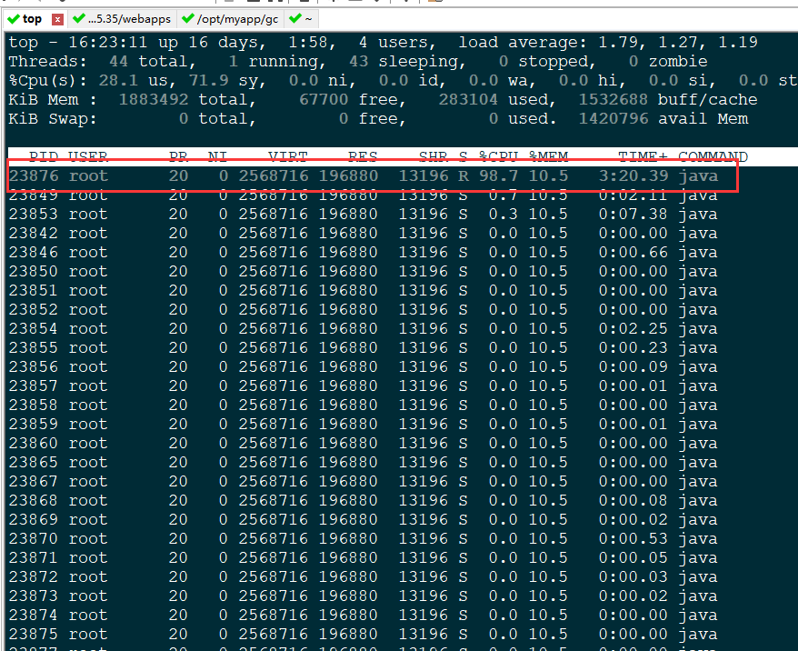
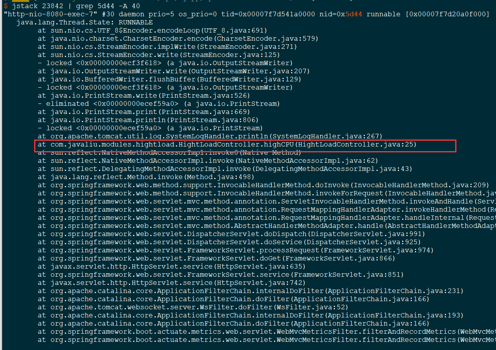

# Tomcat应用负载过高—CPU过高

#### 1. 现象：

在tomcat中部署java的web应用程序，过一段时间后出现tomcat的java进程持续占用cpu高达100%，导致web程序访问受阻。

#### 2. 分析原因

> 1. 进行大量的数据计算
> 2. 出现死循环

#### 3. 解决办法

1) 首先使用 top 命令或者 ps -ef | grep java 找到占用 CPU 过高的**进程ID**，即 **PID**，如图：



2) 找出该进程中占用 CPU 过高的线程，且执行时间较长。命令如下：

```shell
# top H -p 23842
```

或者

```shell
# ps -mp 23842 -o THREAD,tid,time
```

注意：此命令只有 PID 是你要替换的值，其他照抄即可。

如下图：



由此图可知，23876 这个线程占用 CPU 较高。

3）将线程ID转换成 16 进制

```shel
# printf "%x\n" 23876
5d44
```

4）通过 jstack 命令找到对应的线程栈，从而找到对应的代码

```shell
# jstack 23842 | grep 5d44 -A 40
```



关于命令说明：

jstack PID：输出 Java 对应进程的线程栈信息

grep 5d44 -A 40 : 表示搜索 5d44 内容所在的行，并显示该行下面 40 行的信息。