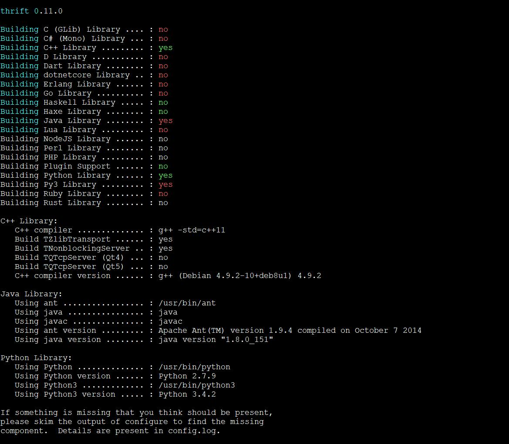

# Thrift 安装

`Thrift` 作为 `RPC` 的通讯框架，有很多的优势，但是唯一不足的是，`Thrift` 官网并没有提供
良好的文档，本文作为一个指南性教程，将一步一步教如何快速掌握 `Thrift` 的使用以及其优良的特性。

`Thrift` 安装比较复杂，本文仅仅以 `Linux` 的发行版 `Debian 8` 为示例，演示安装过程。

使用 `Thrift` 肯定是以某种语言为依托的，本文使用的语言是 `Java` (1.7 以及以上版本)、
`Python` (2.6及以上)，在后续的示例中会以`Python` 和 `Java` 为示例，分别作为服务端或客户端，完成跨语言的调用。所以在安装 `Thrift` 之前，必须先安装 `Python` 和 `JDK`。`Python` 操作系统默认安装，此处不再多说，至于 `Java` 的依赖包 `JDK` 网上有很多安装教程，请自行百度或者Google。此处重点关注 `Thrift` 的安装。

- 首先，安装一些必要的工具和包：   

```shell
$ tar -zxvf  apache-ant-1.9.0-bin.tar.gz
$ vim /etc/profile
    
输入如下配置
export ANT_HOME=/path/to/ant_1.9.0
export JAVA_HOME=/path/to/jdk1.8.0_151
export CLASSPATH=.:$JAVA_HOME/lib/tools.jar:$JAVA_HOME/lib/dt.jar
export PATH=$JAVA_HOME/bin:$ANT_HOME/bin:$PATH
    
$ . /etc/profile
    
$ sudo apt-get install automake bison flex g++ git libboost-all-dev libevent-dev libssl-dev libtool make pkg-config gcc gcc++ mpi-default-dev libicu-dev python-dev python3-dev libbz2-dev zlib1g-dev
    
$ wget http://sourceforge.net/projects/boost/files/boost/1.60.0/boost_1_60_0.tar.gz  
$ tar xvf boost_1_60_0.tar.gz
$ cd boost_1_60_0
$ ./bootstrap.sh
$ ./b2
$ sudo ./b2 install 
```

- Thrift 安装  

```shell
$ wget http://mirrors.tuna.tsinghua.edu.cn/apache/thrift/0.11.0/thrift-0.11.0.tar.gz
$ tar -zxvf thrift-0.11.0.tar.gz
$ cd thrift-0.11.0
$ ./configure --with-cpp=no  // 不添加此项 编译时(make) 不通过
$ make
$ sudo make install
$ which thrift
输出如下：
/usr/local/bin/thrift
则表示安装完成
```
附，安装截图：   


- 也可能是版本等其他原因，`Thrift` 的安装比较麻烦，经常出现安装不成功的情况。一定要自己多动手，多进行 Google 查询解决安装中的问题


