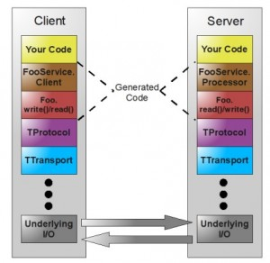

# Thrift 架构设计

先看一下 Thrift 官网的架构图：

### 图中 TProtocol 表示协议层，即定义数据的传输格式。  

* TBinaryProtocol：二进制格式；
* TCompactProtocol：压缩格式；
* TJSONProtocol：JSON格式；
* TSimpleJSONProtocol：提供JSON只写协议, 生成的文件很容易通过脚本语言解析（基本不用）；
* TDebugProtocol：使用易懂的可读的文本格式，以便于debug

### 图中 TTransport 表示传输层，即定义数据的传输方式，可以为TCP/IP传输，内存共享或者文件共享等

* TSocket：阻塞式socket，使用最少，效率最低；
* TFramedTransport：以frame为单位进行传输，非阻塞式服务中使用；
* TFileTransport：以文件形式进行传输；
* TMemoryTransport：将内存用于I/O，java实现时内部实际使用了简单的ByteArrayOutputStream；
* TZlibTransport：使用zlib进行压缩，与其他传输方式联合使用，当前无java实现；

### Thrift 支持的服务模型

* TSimpleServer：简单的单线程服务模型，常用于测试；
* TThreadPoolServer：多线程服务模型，使用标准的阻塞式IO；
* TNonblockingServer：多线程服务模型，使用非阻塞式IO（需使用TFramedTransport数据传输方式）；
* THsHaServer：THsHaServer 是 TNonblockingServer 的扩展，THsHaServer 引入了线程池去处理，
其模型把读写任务放到线程池去处理，Half-sync/Half-async的处理模式，Half-async 是在处理 IO 
事件(accept/read/write io)上，Half-sync 用于 handler 对 rpc 的同步处理。

综上，常用的组合是：  

* 传输格式是：TCompactProtocol
* 传输方式是：TFramedTransport
* 服务模型是：THsHaServer

