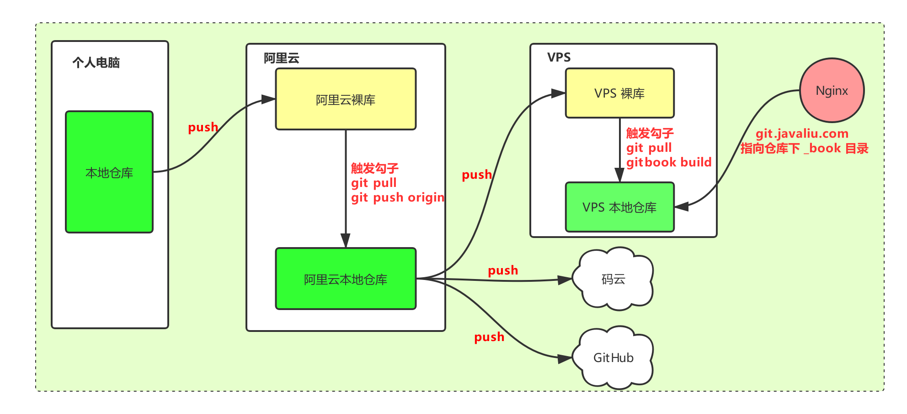

# Git 整合提速

先上图：


## 1. 故事由来

情况是这样的，在国内访问 Github 越来越慢了，有时更新或者提交代码还会失败，即使不失败，也总有一段等待
时间，为了解决速度问题，决定采用国内的代码仓库，如码云，coding 等。

在速度上码云和 coding 都能满足，但是均有其局限性，码云不支持自定义域名绑定, coding 没有 github 有名
，毕竟 github 才是最大的程序员交流社区，所以不能放弃 github。为了满足如上条件，想的方案是先提交码云
然后再异步提交 github ，这样既保证速度，又能解决域名不用备案的问题。

纠结的事情不说了，直接说结果吧。

根据上图所示，将本地代码提交到阿里云Git裸库（保证速度），然后触发 git 钩子，将裸库中的代码 `git
pull` 到阿里云本地，再将代码提交到码云、Github、VPS，做到多处备份，最后触发 VPS 上的 git 钩子，
执行对应的脚本，使得 gitbook 能自动更新。在 VPS 上安装 nginx，并做虚拟主机，使其指向 Gitbook。最后再做一个 A 记录，使二级域名
指向 VPS。

> 说说这个方案的优缺点：

* 优点
    - 速度快, 国内阿里云访问速度快
    - 备份多, 即使 github 不能访问，还有码云
    - 域名无需备案, 国外 VPS 无需备案

* 缺点
    - 操作繁杂，新启一个仓库需要多处设置
    - 耗巨资，两个 VPS 花费高
    - 国外 VPS，博客或者自建的gitbook访问速度慢（有cloudflare做CDN速度好像也不慢）

你有更好的方案吗？请联系 sontek@yeah.net。不胜感激

## 2. 前期准备工作

* 阿里云配置 git  

    主要是配置 `user.name`  和 `user.email`。具体参考[这里](https://git.javaliu.com/02_config/01_git_base_config.html)

* VPS 安装 gitbook。安装教程参考[这里](https://sundry.javaliu.com/sundry/gitbook-doc.html)
* 各个机器的免密操作，本地到阿里云，阿里云到 VPS，Github，码云

```shell
$ ssh-copy-id -i ~/.ssh/id_rsa.pub git@阿里云IP
```

## 3 具体实现

#### 3.1 首先在阿里云和Linode(境外VPS, 以下简称VPS) 对应目录下创建对应的裸库

* 代码库  `/home/git/gitRepo/code`
* Gitbook库 `/home/git/gitRepo/gitbook`
* 其他    `/home/git/gitRepo/sundry`

创建裸库

```shell
$ cd /home/git/gitRepo/gitbook/
$ git init --bare git-book.git
```

#### 3.2 创建新的项目或者从 Github 上 clone 已存在的项目(本地机器)

```shell
# 已存在项目
git clone git@github.com:sontekliu/git-book.git

# 创建新项目
git init git-book
```

#### 3.3 将项目提交到阿里云

* 已存在项目

```shell
$ git remote add aliyun git@阿里云IP:/home/git/gitRepo/gitbook/git-book.git
$ git push aliyun master:master
```

* 新项目

```shell
$ git clone git@阿里云IP:/home/git/gitRepo/gitbook/go-book.git
```

#### 3.4 将 origin 的地址改成阿里云地址, 即本地只提交到阿里云，提高速度(本地机器)

新项目是直接从阿里云clone下来的，origin 地址默认就是阿里云地址，无需修改。

针对已存在的项目，编辑本项目下的 `.git/config` 文件，修改如下：

愿内容（注意已做删减）：

```
[remote "origin"]
	url = git@github.com:sontekliu/git-book.git
	fetch = +refs/heads/*:refs/remotes/origin/*
[remote "aliyun"]
	url = git@39.105.28.88:/home/git/gitRepo/gitbook/git-book.git
	fetch = +refs/heads/*:refs/remotes/aliyun/*
```

修改成如下内容：

```
[remote "origin"]
	url = git@39.105.28.88:/home/git/gitRepo/gitbook/git-book.git
	fetch = +refs/heads/*:refs/remotes/origin/*
```

去掉了刚刚添加的 `aliyun` ，并将原来 `Github` 的地址更换成了阿里云地址

#### 3.5 将项目备份多份(阿里云)

当提交代码到阿里云时，触发 git 的勾子，将代码再次提交到 Github和码云

* 首先在对应平台(码云和Github)创建相应的仓库

* 将提交到阿里云裸库的项目 clone 到阿里云本地

    * 代码库  `/home/git/gitspace/code`
    * Gitbook库 `/home/git/gitspace/gitbook`
    * 其他    `/home/git/gitspace/sundry`

    ```shell
    $ cd /home/git/gitspace/gitbook
    $ git clone /home/git/gitRepo/gitbook/git-book.git
    ```

* 修改项目(在阿里云)地址，使其指向多个地址

修改 `clone` 到阿里云本地仓库的文件，`/home/git/gitspace/gitbook/git-book/.git/config`

愿内容为:

```
[remote "origin"]
        url = /home/git/gitRepo/gitbook/git-book.git
        fetch = +refs/heads/*:refs/remotes/origin/*
```

修改为:

```
[remote "origin"]
        url = /home/git/gitRepo/gitbook/git-book.git
        url = git@github.com:sontekliu/git-book.git 
        url = git@gitee.com:sontekliu/git-book.git
        url = git@VPS_IP:/home/git/gitRepo/gitbook/git-book.git
        fetch = +refs/heads/*:refs/remotes/origin/*
```

此处额外添加了三个地址，分别是 `Github`，`码云`，个人VPS, 此处注意一定要将阿里云 `git` 用户的公钥都添加
到对应服务器，以便在代码提交的时候能够免密

* 编写 Git 勾子脚本使其自动化

在阿里云的本地仓库中编写脚本，使其自动化提交。

```shell
$ cd /home/git/gitRepo/gitbook/git-book.git/hooks/
$ cp post-update.sample post-update
$ vim post-update
```

`post-update` 内容如下：

```
#!/bin/sh
#
# An example hook script to prepare a packed repository for use over
# dumb transports.
#
# To enable this hook, rename this file to "post-update".

# exec git update-server-info
unset GIT_DIR
GIT_DIR=/home/git/gitspace/gitbook/git-book
cd $GIT_DIR
echo `pwd`
# 拉取代码到阿里云本地
git pull origin master 
# 提交到远程
git push origin >&- 2>&- &
# git push origin >/dev/null 2>&1 &
```

## 4. VPS 配置

> 如果没有域名或者没有 gitbook，可以不看此章节。

#### 4.1 编写 git 钩子脚本，使其自动更新 gitbook

在 VPS 的本地仓库中编写脚本，使其自动更新 gitbook 内容。

```shell
$ cd /home/git/gitRepo/gitbook/git-book.git/hooks/
$ cp post-update.sample post-update
$ vim post-update
```

`post-update` 内容如下：

```
#!/bin/sh
#
# An example hook script to prepare a packed repository for use over
# dumb transports.
#
# To enable this hook, rename this file to "post-update".

# exec git update-server-info
unset GIT_DIR
GIT_DIR=/home/git/gitspace/gitbook/git-book
cd $GIT_DIR
# 更新仓库
git pull origin master
# 编译更新 gitbook
gitbook build >>/dev/null
```

#### 4.2 配置虚拟主机

首先，确保 VPS 上已安装 Nginx，可参考[这里](https://sundry.javaliu.com/nginx/nginx-install.html)安装。

```shell
# root 用户操作

# cd /etc/nginx
# mkdir sites-available sites-enabled

# 编辑 nginx.conf, 最下面添加如下内容
# vim /etc/nginx/nginx.conf
--------------------------
http{
    // .... 省略内容

    include sites-enabled/*;
}
```

* 创建对应 gitbook 的配置文件

```shell
# cd /etc/nginx/sites-available
# vim git.conf
------------------------------
# 内容如下：

server {
    listen 80;
    charset utf-8;
    access_log logs/git.access.log main;
    server_name git.javaliu.com;

    location / {
        root /home/git/gitspace/gitbook/git-book/_book;
        index index.html index.htm;
    }
}
```

如果你的网站开启了 `https` , 配置内容如下：

```
# vim git.conf
--------------------------
server {
        charset utf-8;
        access_log logs/git.access.log main;
        server_name git.javaliu.com;

        location / {
                root /home/git/gitspace/gitbook/git-book/_book;
                index index.html index.htm;
        }

    listen 443 ssl; # managed by Certbot
    ssl_certificate /etc/letsencrypt/live/javaliu.com/fullchain.pem; # managed by Certbot
    ssl_certificate_key /etc/letsencrypt/live/javaliu.com/privkey.pem; # managed by Certbot
    include /etc/letsencrypt/options-ssl-nginx.conf; # managed by Certbot
    ssl_dhparam /etc/letsencrypt/ssl-dhparams.pem; # managed by Certbot


}
server {
    if ($host = git.javaliu.com) {
        return 301 https://$host$request_uri;
    } # managed by Certbot

    listen 80;
    server_name git.javaliu.com;
    return 301 https://$server_name$request_uri;
}
```

* 启用配置, 在 sites-enabled 创建对应的软连接

```shell
# cd /etc/nginx/sites-enabled
# ln -s /etc/nginx/sites-available/git.conf  git.conf
# nginx -s reload       # 重新加载 nginx 配置文件
```

## 5. 结束

大功告成!!!


