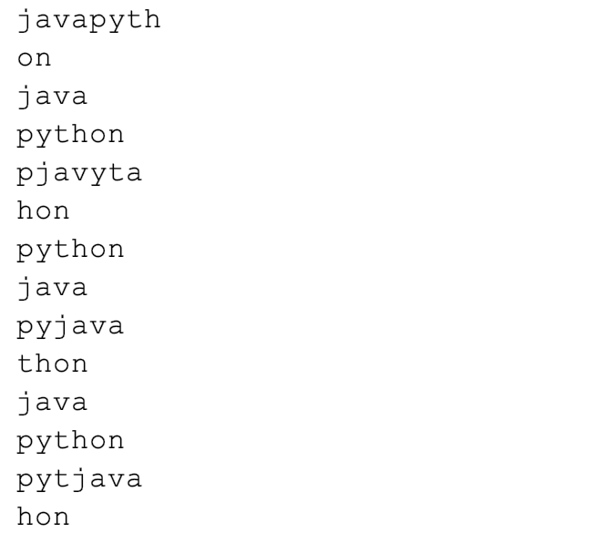

# 线程之间的互斥

首先大家要明白，只有多线程操作共享数据，才会出现互斥问题，最简单的案例就是银行转账问题，此案例网上已有很多说明，此处不再赘述。

下面以一个字符串输出的案例说明多线程互斥的问题。场景是这样的，有一个输出打印的类，再有两个线程分别进行输出操作，第一个线程输出 `java`，第二个线程输出 `python`，要求是两个线程分别输出，互不影响。代码示例如下：

```java
public class TraditionalThreadSynchronized {

    public static void main(String args[]){
        new TraditionalThreadSynchronized().execute();
    }

    private void execute(){
        final Outprinter outprinter = new Outprinter();

        // 此线程输出 java
        Thread t1 = new Thread(new Runnable() {
            @Override
            public void run() {
                while (true){
                    try {
                        // sleep 10 毫秒
                        Thread.sleep(10);
                    } catch (InterruptedException e) {
                        e.printStackTrace();
                    }
                    outprinter.print2("java");
                }
            }
        });
        t1.start();

        // 此线程输出 python
        Thread t2 = new Thread(new Runnable() {
            @Override
            public void run() {
                while (true){
                    try {
                        // sleep 10 毫秒
                        Thread.sleep(10);
                    } catch (InterruptedException e) {
                        e.printStackTrace();
                    }
                    outprinter.print3("python");
                }
            }
        });
        t2.start();
    }

    /**
     * 输出打印功能的类
     */
    static class Outprinter{

        // 未加任何互斥操作
        public void print(String name){
            int len = name.length();
            for (int i=0;i<len;i++){
                System.out.print(name.charAt(i));
            }
            // 换行
            System.out.println();
        }

        // 使用 synchronized 关键字修饰代码块
        public void print2(String name){
            int len = name.length();
            synchronized (this) {
                for (int i = 0; i < len; i++) {
                    System.out.print(name.charAt(i));
                }
                // 换行
                System.out.println();
            }
        }

        // 使用 synchronized 关键字修饰对象方法
        public synchronized void print3(String name){
            int len = name.length();
            for (int i=0;i<len;i++){
                System.out.print(name.charAt(i));
            }
            // 换行
            System.out.println();
        }

        // 使用 synchronized 关键字修饰静态方法
        public static synchronized void print4(String name){
            int len = name.length();
            for (int i=0;i<len;i++){
                System.out.print(name.charAt(i));
            }
            // 换行
            System.out.println();
        }

        // 使用 synchronized 关键字修饰代码块
        public static synchronized void print5(String name){
            int len = name.length();
            synchronized (Outprinter.class) {
                for (int i = 0; i < len; i++) {
                    System.out.print(name.charAt(i));
                }
                // 换行
                System.out.println();
            }
        }

    }
}
```

1. 如果两个线程均执行 `print` 方法，那么控制台输出的结果将是如下内容（注意此结果每次输出均不一样）：


由此图可知，`java` 与 `python` 的输出明显是混乱了，没有达到互不影响的要求，即两个线程不互斥。   
2. 如果两个线程均执行 `print2` 方法，则不会出现混乱的情况，可以达到互斥的效果。`synchronized` 关键字保证了线程之间的互斥操作。`synchronized` 要实现排他性，必须持有一把锁，即当有一个线程获取这把锁之后，其他线程均拿不到这把锁，那边其他线程只能等待，直到拿到锁之后才能执行代码块里面的代码。此处是 `synchronized(this)`，表示使用的锁是 `Outprinter` 的实例对象，两个线程执行输出时，使用的是同一个对象，所以完全可以实现排他性。  
如果两个线程均使用 `print3`、`print4`、`print5` 均能达到互斥的效果。  
3. 如果一个线程使用 `print2` 一个线程使用 `print3` 也可以达到互斥的效果，因为 `synchronized` 作用到实例方法上时使用的锁就是该对象，所以可以达到互斥。  
4. 如果一个线程使用 `print3` 一个线程使用 `print4` 则达不到互斥的效果。`synchronized` 关键字作用到静态方法上时，使用的是类对象，而不是实例对象，两者使用的不是同一把锁，所以达不到互斥的效果。`print4` 和 `print5` 则可以互斥，二者使用的是同一把锁。

**总结：** 
如果 `synchronized` 关键字作用到实例方法时，使用的锁是该实例对象；如果是静态方法，使用的锁对象是类对象。

如果 `synchronized` 关键字作用到代码块时，关键看括号里面的锁是什么，只要是多个线程使用的是同一把锁，那么就可以达到互斥的效果。

尽量使用 `synchronized` 修饰代码块，互斥更少的代码，能达到的更高的并发性。


